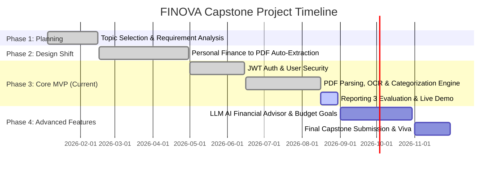

# FINOVA – Financial Intelligence Infrastructure
## Updated Project Roadmap & Deliverable Schedule

**Project Title:** FINOVA – Financial Intelligence Infrastructure  
**Course:** Software Engineering Final Year Capstone Project  
**Current Milestone:** Phase 3 / Reporting 3 Prototype Evaluation  

---

## Capstone Project Timeline

---

## Phase Breakdown

### Phase 1: Problem Definition & Initial Concept (Completed)
- **Initial Focus**: Manual personal finance tracker.
- **Outcome**: Reviewed by faculty; identified key flaw (manual logging friction leads to poor real-world retention).

### Phase 2: System Pivot & Architectural Design (Completed)
- **Focus**: Strategic pivot to **Automated Bank Statement PDF Processing**.
- **Outcome**: Designed PDF text/OCR extraction pipeline, 15-category classification system, and full-stack schema (Next.js, Node.js, Express, PostgreSQL, Prisma).

### Phase 3: Working MVP Implementation — Reporting 3 Deliverable (Completed / Current)
- **Module 1**: User Authentication (Register, Login, JWT access/refresh token rotation, Protected route guards, persistent session state).
- **Module 2**: Bank Statement Processing (Drag-and-Drop PDF Upload, 4-Tier PDF Parsing & Tesseract OCR Fallback, 15-Category Rule Classifier, PostgreSQL persistence, Recharts Financial Dashboard, Master Ledger with Search/Filter & CSV Export).
- **Evaluation Assets**: Implementation Status Report, Technical Explanation, Challenges Report, Project Plan, Presentation Outline, Live Demo Guide.

### Phase 4: Future Enhancements — Final Capstone Deliverable (Upcoming)
- **LLM AI Financial Advisor**: Integration of LLM API for natural language financial queries.
- **Custom Category Budget Threshold Alerts**: Automated notification when spending exceeds target budgets.
- **Password-Protected PDF Decryption**: Decryption handling for password-locked bank PDF statements.
- **Final Evaluation & Viva**: Comprehensive documentation, performance benchmarks, and final presentation.
